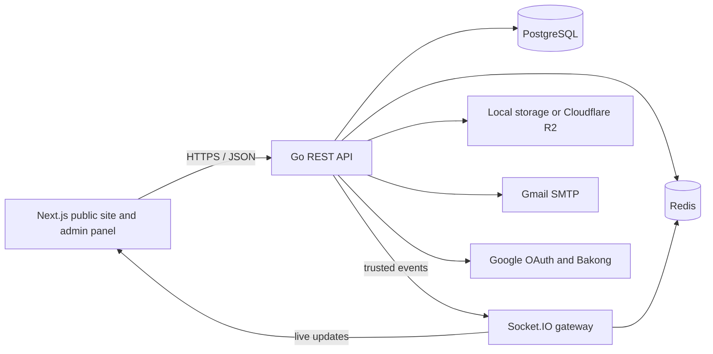

# Unity Runn Club

[](https://github.com/sovandara1607/Unity-RUNN/actions/workflows/ci.yml)

An event-management platform for community races—from publishing an event and accepting a registration to payment, ticket delivery, and race-day QR check-in.

The repository contains a public Next.js site, a role-aware operations panel, a Go API, a Socket.IO gateway, PostgreSQL, and Redis. It is under active development; see [Project status](./progress.md) for completed work and known production gaps.

## What the platform does

- Publishes event calendars, event artwork, schedules, rules, FAQs, and ticket categories.
- Gives administrators control of public branding, logos, hero slides, carousels, and announcement strips.
- Supports account registration, password login, Google sign-in, rotating sessions, and role-based access.
- Registers runners, manages availability, and resumes unfinished event drafts in the admin workflow.
- Creates Bakong KHQR payment checkouts through a provider abstraction, with a safe mock provider for local development.
- Generates downloadable ticket cards with scannable QR codes and PDF payment receipts.
- Sends branded registration and payment email, including ticket and receipt attachments.
- Provides a camera-based check-in station, manual lookup fallback, duplicate protection, and a live arrival feed.
- Exposes audit logs, user management, operational metrics, and a sanitized system-status console.

## Architecture



The Go API owns business rules and authorization. PostgreSQL is the source of truth, Redis supports coordination and realtime delivery, and the Socket.IO service only broadcasts trusted server-side events.

## Technology

| Area | Stack |
| --- | --- |
| Public and admin UI | Next.js 16, React 19, TypeScript, Tailwind CSS |
| API | Go 1.25, Chi, pgx |
| Data | PostgreSQL 16, Redis 7 |
| Realtime | Socket.IO with the Redis adapter |
| Files | Local persistent volume or Cloudflare R2 |
| Authentication | JWT access tokens, rotating HttpOnly refresh cookies, Google OAuth 2.0 |
| Payments | Provider interface with Bakong KHQR and local mock implementations |
| Email | Gmail SMTP with HTML/text templates and PDF attachments |
| Local orchestration | Docker Compose and Make |

## Quick start

### Prerequisites

- Docker Desktop with Docker Compose
- Go 1.25 or newer for migrations, seeds, and backend commands
- Node.js 22 or newer with npm
- `make`

### 1. Configure the backend

```bash
cp .env.example .env
openssl rand -hex 48
```

Paste the generated value into `JWT_SECRET` in `.env`. The remaining defaults support local development: uploaded files use local storage, outbound email is logged instead of sent, and payments use the mock provider.

Do not commit `.env`, access keys, app passwords, OAuth secrets, Bakong tokens, or production database credentials.

### 2. Start infrastructure and services

```bash
docker compose up -d --build
make migrate
make seed
```

`make seed` creates development data and prints the local demo accounts it created. Seeded credentials are for local development only.

### 3. Start the frontend

```bash
cd frontend
cp .env.example .env.local
npm install
npm run dev
```

Open [http://localhost:3000](http://localhost:3000).

## Local services

| Service | Address |
| --- | --- |
| Public site | [http://localhost:3000](http://localhost:3000) |
| Admin panel | [http://localhost:3000/admin](http://localhost:3000/admin) |
| System console | [http://localhost:3000/admin/system](http://localhost:3000/admin/system) |
| API health | [http://localhost:8080/health](http://localhost:8080/health) |
| API readiness | [http://localhost:8080/ready](http://localhost:8080/ready) |
| Realtime health | [http://localhost:8081/health](http://localhost:8081/health) |
| PostgreSQL | `localhost:5432` |
| Redis | `localhost:6379` |

## Roles and access

Roles form a fixed hierarchy. A higher role inherits the capabilities allowed to lower roles.

| Role | Typical access |
| --- | --- |
| `USER` | Public account, profile, registrations, payments, and tickets |
| `STAFF` | Check-in station and operational runner lookup |
| `ADMIN` | Event, category, registration, and public-site management |
| `SUPER_ADMIN` | User roles, audit data, and sanitized system configuration |

Authorization is enforced by the API, not only by hidden navigation or client-side checks.

## Common commands

Run these from the repository root unless noted otherwise.

```bash
make dev               # build and run PostgreSQL, Redis, API, and realtime
make dev-infra         # run only PostgreSQL and Redis
make dev-logs          # follow container logs
make dev-down          # stop local containers

make migrate           # apply pending database migrations
make migrate-down      # roll back one migration
make seed              # seed local event and account data

make test              # Go unit tests with the race detector
make test-integration  # repository tests against PostgreSQL
make lint              # go vet and gofmt check
make build             # build backend/bin/server
```

Frontend checks:

```bash
cd frontend
npm run lint
npm run build
```

Realtime syntax check:

```bash
cd realtime
npm run check
```

## Continuous integration

Every pull request and every push to `main` runs the [CI workflow](.github/workflows/ci.yml) on GitHub Actions:

| Job | What it checks |
| --- | --- |
| Backend lint | `go vet` and `gofmt` |
| Backend unit tests | `go test ./... -race` |
| Backend integration tests | Migrations apply cleanly, then `go test -tags=integration -p 1 -race` against PostgreSQL 16 |
| Frontend | `npm run lint` and `npm run build` |
| Realtime | `node --check server.mjs` |
| Docker Compose | `docker compose config --quiet` |

These mirror the local commands above. CD (automated deployment) is not configured yet.

## Configuration

Copy [`.env.example`](./.env.example) rather than creating configuration from memory. It documents these groups without containing live credentials:

- application, PostgreSQL, Redis, and CORS;
- Socket.IO public and internal addresses;
- local or Cloudflare R2 object storage;
- JWT lifetime and password hashing;
- Gmail SMTP and Google OAuth;
- notification worker timing;
- payment provider and Bakong KHQR settings.

Frontend public variables are documented in [`frontend/.env.example`](./frontend/.env.example). Detailed Google setup is in [`docs/google-services.md`](./docs/google-services.md).

Production should use a secret manager, HTTPS, restricted origins, separate credentials per environment, a private Redis instance, and a public R2 custom domain or the API media proxy. The S3 API endpoint is not a public image URL.

## Project layout

```text
Unity-RUNN/
├── backend/
│   ├── cmd/                 # API, migrations, seed, and email utilities
│   ├── internal/            # domain services, repositories, and handlers
│   └── migrations/          # ordered PostgreSQL schema migrations
├── frontend/
│   ├── public/              # bundled logos and public assets
│   └── src/                 # Next.js pages, components, types, and API client
├── realtime/                # Socket.IO gateway and Redis adapter
├── docs/                    # focused integration guides
├── docker-compose.yml       # local service topology
├── Makefile                 # development and verification commands
├── progress.md              # current capabilities, verification, and risks
└── continue.md              # detailed implementation continuation notes
```

## Important workflows

### Event publishing

Admins create an event draft, upload or link its poster, add ticket categories, and publish it. Object uploads are independent of event creation: the returned media URL is stored with the event, while the binary remains in local storage or R2.

### Registration and payment

The API validates category availability and participant data, then creates a registration. Free registrations can be confirmed directly; paid registrations proceed through the configured payment provider. Local development defaults to a mock provider so no real money moves.

### Ticket and check-in

Confirmed registrations receive a stable ticket. The downloadable card includes the QR code and event details. Staff scan it against a selected event; the API verifies the ticket, confirmation state, event match, and prior check-in before recording entry.

### Notifications

Email is queued and retried asynchronously. Without SMTP settings, development uses a no-op sender and logs the message. With Gmail SMTP configured, confirmation and payment messages include the branded ticket and receipt documents.

## Security model

- Short-lived access tokens are paired with hashed, rotating refresh tokens in an HttpOnly cookie.
- Passwords use bcrypt and are never returned by the API.
- Sensitive admin routes use server-side role checks.
- Authentication and registration endpoints are rate limited.
- Uploads are size/type checked and object-store credentials remain server-side.
- Check-in is protected by staff authentication, event validation, and database uniqueness.
- Audit logs record security-sensitive administrative actions.
- The system console reports whether integrations are configured without exposing their values.

Before a production launch, complete the open security and operational work listed in [progress.md](./progress.md), including CI/CD, managed backups, monitoring, production payment certification, and deployment hardening.

## Further documentation

- [Project progress and production gaps](./progress.md)
- [Continuation and implementation notes](./continue.md)
- [Google OAuth and Gmail SMTP setup](./docs/google-services.md)
- [Frontend-specific development notes](./frontend/README.md)

When documentation and code disagree, treat the code and migrations as the source of truth, then update the documentation in the same change.
