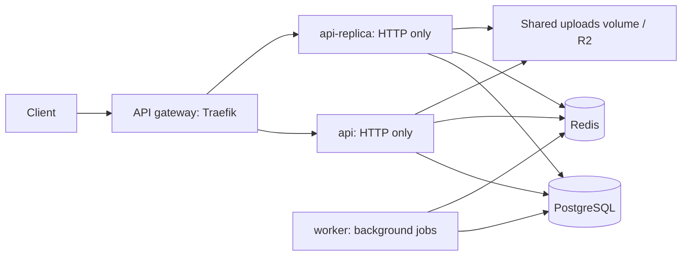

# API load balancing

Both Compose deployments run this topology:



Locally the gateway owns the existing `${PORT:-8080}` host port; clients keep the
same base URL. On Dokploy, the public HTTPS proxy forwards the API domain to
`api-gateway:8080`. The frontend and Socket.IO gateway each remain single instances.

## Routing and failover

- `deploy/traefik/api.yml` lists two explicit backends. Equal-weight round robin
  distributes requests across them without sticky sessions.
- Every five seconds, the gateway checks `/ready`, which pings PostgreSQL and
  Redis. A check must return 200 within three seconds. Failed checks remove that
  instance; successful checks allow it to rejoin. The API's `/health` only checks
  liveness and is intentionally not the routing probe.
- New requests use healthy instances after failure detection. Requests already
  in flight, or arriving during detection, can fail. When neither instance is
  ready, the gateway returns 503. No retry middleware replays registration or
  payment writes automatically.
- The gateway's internal `/ping` on port 9090 checks its own liveness. It is not
  published and does not indicate that API backends are ready.
- Gateway JSON access logs include `ServiceURL`, showing the selected backend.
  Authentication, refresh tokens, rate limits, registration locks, and cached
  availability use shared secrets or shared stores. Lock release uses an atomic
  Redis compare-and-delete operation so an expired owner cannot remove a new lock.

See the [Traefik service documentation](https://doc.traefik.io/traefik/v3.7/reference/routing-configuration/http/load-balancing/service/)
for load-balancer and health-check behavior.

## Process roles and capacity

`PROCESS_ROLE=api` serves requests without background jobs. `PROCESS_ROLE=worker`
runs background jobs and only serves `/health` and `/ready`. `PROCESS_ROLE=all`
is the default for standalone `go run` usage, preserving the original behavior.
Compose sets the roles explicitly. Keep exactly one worker until concurrent email
sweeps are supported; do not scale it with the API replicas. If the worker stops,
requests still work but background work waits for its restart.

The named upload volume is shared by both API containers on the same Docker host.
For multiple hosts, use shared object storage such as the existing R2 integration.

Pool capacity is per process: allow `2 × DATABASE_MAX_CONN + WORKER_DATABASE_MAX_CONN`,
plus migration and administrative connections, below PostgreSQL's connection limit.
Defaults are 8 connections per API and 4 for the worker locally (20 of 30), and
10 per API plus 4 for the worker on Dokploy (24 of 40). Environment overrides apply.

Memory limits also apply per container: each API replica and worker inherits
`API_MEMORY_LIMIT`. The gateway adds `GATEWAY_MEMORY_LIMIT` (128 MiB by default).
Allow capacity for all containers, the frontend, and the host OS before deployment.

This is a fixed two-instance API pool on one host. It does not provide autoscaling
or protection against failure of the host, gateway, database, or Redis. To add more
API instances, add Compose services inheriting `api-service` and their URLs to the
gateway pool, then adjust the connection and memory budgets. `--scale api=N` alone
does not update the explicit pool.

## Run and verify

```sh
docker compose up -d --build
make migrate
curl -fsS http://localhost:8080/ready
```

Generate a few requests and check that access logs contain both backend names:

```sh
for i in 1 2 3 4 5 6; do curl -fsS http://localhost:8080/api/v1/stats; done
docker compose logs --since 1m api-gateway
```

On a development stack, stop one API, allow about eight seconds for health-check
detection, and repeat the requests. Restore the instance afterward; it rejoins
after a successful health check:

```sh
docker compose stop api-replica
# After health-check detection, requests should still succeed.
curl -fsS http://localhost:8080/api/v1/stats
docker compose start api-replica
```

For an isolated automated test, put Go, PostgreSQL (`initdb`, `postgres`,
`createdb`, `pg_isready`), Redis, and Traefik 3.7.12 on PATH, then run:

```sh
python3 deploy/test_load_balancing.py
```

The test creates fresh local databases and free ports without reading `.env`.
It builds the actual API, applies migrations, verifies both backends receive
requests, checks cross-instance authentication and refresh tokens, verifies the
worker role and registration-lock ownership, stops and restores an API, and
confirms live-but-unready instances are removed when Redis fails. It stops all
test processes afterward and retains diagnostic logs under `tmp/`.
