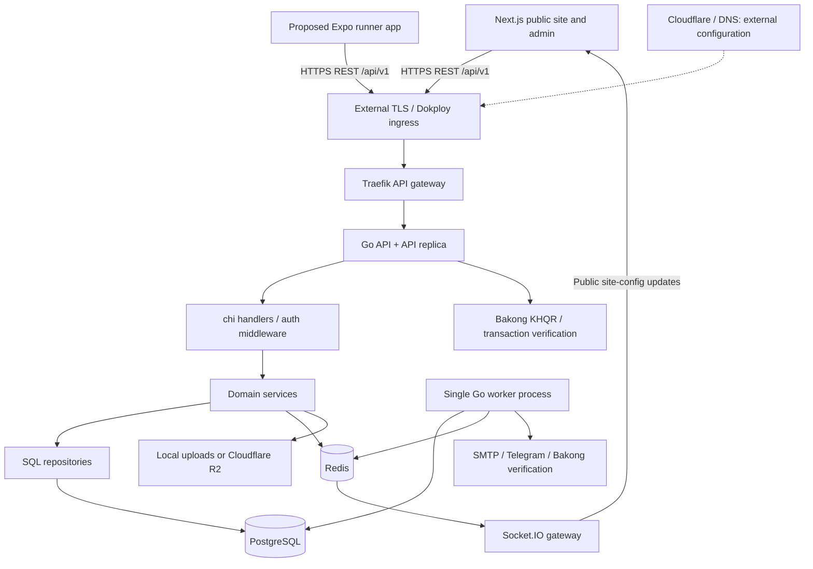
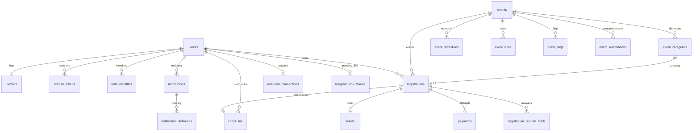

# Unity Runn Club — Architecture Discovery Report

Discovery baseline: commit `f2d7188`, 9 September 2026. Written before implementation. This report describes repository evidence, not a verification of running production infrastructure. Real environment secrets were not inspected. The first milestone and its validation are recorded separately in `mobile/README.md`.

## 1. Current system architecture

The system is already a modular Go monolith shared by the public website and admin interface. Add Expo as another HTTPS client; no second backend is needed. Clients do not access PostgreSQL or Redis directly. Cloudflare DNS/proxy is a proposed external entry point; R2 support is verified in code, but actual DNS/proxy settings are not managed in this repository.



Evidence: `backend/cmd/server/main.go`, `backend/internal/http/router.go`, both Compose files and `realtime/server.mjs`. Notifications run inside the existing Go binary with a separate process role, not a new service codebase.

## 2. Repository structure

| Existing path | Responsibility |
|---|---|
| `backend/cmd/server` | Dependency wiring, process roles, workers, HTTP lifecycle |
| `backend/cmd/migrate` | Goose migrations |
| `backend/cmd/seed` | Development data |
| `backend/cmd/emailpreview`, `emailtest` | Email utilities |
| `backend/internal/http` | chi route inventory, health/readiness, server timeouts |
| `backend/internal/auth` | Password and Google login, JWT, refresh tokens, profiles, hierarchical roles |
| `backend/internal/events` | Events, categories, schedules, FAQs, rules, duplication, poster processing |
| `backend/internal/registrations` | Reservations, availability, payments, ticket identifiers, cancellation, reconciliation |
| `backend/internal/checkin`, `auditlog` | Staff scans and audit records |
| `backend/internal/payments` | Provider abstraction; mock and Bakong |
| `backend/internal/notifications`, `email`, `telegram`, `eventautomations` | Durable notifications, delivery, reminders and scheduled announcements |
| `backend/internal/objectstore`, `realtime`, `siteconfig` | Media, public updates and editable site content |
| `backend/internal/admin`, `stats`, `systemstatus` | Operational APIs |
| `backend/internal/config`, `database`, `redisclient`, `middleware`, `httpresponse`, `logger`, `tokenhash` | Infrastructure and shared helpers |
| `backend/migrations` | 31 ordered SQL migration files |
| `backend/docs`, `docs` | Integration and export guides; no OpenAPI spec found |
| `frontend/src/pages` | Next.js Pages Router: public events, auth, dashboard/profile and admin |
| `frontend/src/components`, `lib`, `types.ts`, `styles` | Web presentation, central API client, manually maintained contracts |
| `frontend/e2e` | Playwright UI tests |
| `frontend/public` | Web-owned assets, including club photography |
| `realtime` | Outbound-only public Socket.IO gateway with Redis adapter |
| `deploy` | Dokploy instructions, Traefik config and isolated failover test |
| `.github/workflows` | CI and GHCR image publishing |

No mobile project existed at discovery. There are no top-level generic `services/`, `handlers/` or `repositories/` directories: those files belong to individual Go domains.

## 3. Backend architecture

Go module `github.com/unity-run-club/api`, declared Go 1.25.7. chi v5 routes call thin JSON handlers, then domain services, then pgx repositories with explicit SQL. Services depend on small consumer-defined interfaces for tests. Wiring is explicit in `cmd/server`; there is no ORM or dependency injection framework.

Registration depends on event readers and the payment provider; check-in depends on registration readers. Availability uses Redis as an optimization, with PostgreSQL row locking and constraints as the final capacity/duplicate guarantees. Startup supports `PROCESS_ROLE=all|api|worker`; deployed API replicas do not run background jobs.

HTTP middleware applies request IDs, panic recovery, security headers, configured CORS, a 1 MiB JSON body limit and structured logging. Server timeouts are 5s header, 15s read/write and 60s idle. Most success responses use `{data: ...}` and failures `{error: {code, message}}`. Recovery, media and health endpoints are exceptions.

## 4. Database architecture

Verified from all 31 migrations: **23 application tables** plus Goose's migration bookkeeping. PostgreSQL UUIDs use `pgcrypto`; dates, times and timestamps are distinct SQL types. pgxpool uses configurable pool sizes, one-hour connection lifetime and 30-minute idle timeout.



The business chain is **User → Registration → Payment → Ticket → Check-in**; the SQL ticket and check-in rows both reference registration, not payment or each other. Free registration has a ticket without a payment. `registration_counters` allocates year-scoped `URC-YYYY-NNNNNN` numbers transactionally. `audit_logs` uses a nullable actor FK and polymorphic entity references. `site_settings` is a singleton with an optional event announcement FK; `site_setting_versions` stores JSONB snapshots.

Critical constraints: one PENDING/CONFIRMED registration per user/event; category deletion RESTRICT after migration 18; one ticket and check-in per registration; unique refresh/token hashes, normalized email and provider references; category currency USD/KHR after migration 26. The database does not enforce category/event consistency with a composite FK; the service checks it. Several parent relationships cascade on deletion, so retention must be considered before future delete features.

`registration_custom_fields` exists, but current request/service code has no dynamic form-definition or custom-answer workflow. Do not infer that this feature is implemented from its table.

## 5. Authentication architecture

Email/password register/login → bcrypt verification → HS256 access JWT + random 32-byte refresh secret → bearer-protected requests → refresh rotation → logout revocation.

Web access token: in module memory (`frontend/src/lib/api.ts`). Refresh secret: HttpOnly cookie at `/api/v1/auth`, SameSite=Lax in development, SameSite=None and Secure outside development. Raw refresh tokens are never persisted server-side; SHA-256 hashes live in PostgreSQL. Defaults are 15-minute access and 30-day refresh lifetimes. Refresh looks up the hash, checks expiry/revocation, conditionally revokes it and issues a replacement. The conditional SQL update prevents two consumers from both rotating the same token, though the losing race currently surfaces a generic server error. Revocation and replacement insertion are separate operations: a failure can require login again. There is no token-family replay revocation.

JWT verification fixes algorithm, issuer `unity-run-club-api`, audience `unity-run-club-web`, subject/user identity and role. The historical audience label is not a device check and is accepted by the shared API; preserve it for compatibility. Role claims remain effective until access expiry, even after logout or a role change. There is no immediate access-token revocation lookup.

Refresh/logout apply an allowed-Origin check when an Origin header is supplied; absent Origin is accepted for non-browser clients. Most protected operations already require bearer headers, rather than cookies, avoiding ambient cookie authentication for those routes.

Google OAuth uses a browser-bound state cookie, server-side code exchange and verified Google email linking, then returns to the web callback, which refreshes the session. It has no native return/exchange flow. Password reset, email verification and account deletion APIs were not found.

**Milestone change:** add explicit native auth routes in the same Go handler/service with JSON refresh token transport, never consulting or issuing cookies. This supports SecureStore while retaining the web endpoints unchanged. Native mode is transport selection, not a privileged role. Reuse validation, rate limiter, signing, hashing and rotation.

## 6. Event lifecycle

DRAFT → PUBLISHED → REGISTRATION_OPEN → REGISTRATION_CLOSED → COMPLETED → ARCHIVED. Active states may transition to CANCELLED, then ARCHIVED. The service validates transitions; repeated same-state updates are allowed. Public reads expose PUBLISHED, REGISTRATION_OPEN, REGISTRATION_CLOSED and COMPLETED. STAFF+ bearer tokens can preview other states. Detail path parameter is a **slug**, despite the router naming it `{id}`. Writes and registration use UUIDs.

Details embed categories, schedule, FAQs and rules. Public category capacity is masked to zero; zero must not be interpreted as sold out. The separate availability endpoint returns capacity/taken/available. List supports status/statuses, limit and offset, default 20, maximum 100; no server search/date/distance filters. SQL sorts only by event date, without a unique tie-breaker. Dates/times serialize as Go timestamps despite representing calendar dates/wall-clock times; mobile must preserve the date and time portions rather than shifting them into the phone's timezone.

## 7. Registration lifecycle

Browse `/events/` → detail by slug → choose category → collect fixed runner fields → POST event UUID registration. The server checks category ownership, event state, registration windows, category deadline/status, active duplicates and capacity. Registration writes lock the category row, count active entries and create the number/registration/ticket transactionally where applicable; Redis lock failure does not replace PostgreSQL safety.

Free entry becomes CONFIRMED with a ticket immediately. Paid entry starts PENDING and reserves a place; checkout creation failure attempts to cancel the reservation. Confirmation enqueues notifications. Users can retrieve their own entries; STAFF+ can retrieve others. Cancellation rejects inactive or already checked-in registrations in service code. REFUNDED is a schema state, not a complete refund feature.

## 8. Payment lifecycle

Providers: local mock and Bakong. Production explicitly rejects mock in `cmd/server`. Bakong creates a merchant KHQR locally, stores its MD5 reference/checkout payload and expiry, and queries `/v1/check_transaction_by_md5` from the server. It validates receiver, currency and amount. USD amounts use cents; **KHR uses whole riel**, despite the `amount_cents` field name. No hosted checkout, active payment webhook or refund implementation exists. The checkout contract has `deep_link`, but the Bakong provider does not populate it.

Explicit verification and a leased background reconciler confirm stored payments. Reconciliation uses `FOR UPDATE SKIP LOCKED`, a lease and backoff; confirmation updates payment, registration and ticket inside a transaction. Mobile must refetch server state after returning from any future banking app; a redirect is never proof of payment.

**Existing risk to address before mobile payments:** `Register` still invokes the table-wide `expirePendingPayments` sweep before starting a new registration. Its SQL cancels expired pending entries without provider verification. Thus a new registration can race a just-settled older payment, despite read endpoints having been fixed to avoid this sweep. Record and fix separately before enabling native payment registration. Cancellation/check-in/confirmation also need coordinated row locking to avoid state changes between service checks and writes.

## 9. Ticket lifecycle

Confirmation creates a ticket row containing an opaque token hash. Immediate free/mock registration can return the raw token once. However, `IssueTicketToken` currently returns the **registration number**, and POST ticket responds with both `ticket_token` and `ticket_code` containing that number. Web wallet and email QR generation also use registration numbers. These are guessable, not signed secrets. The staff endpoint authorizes scans, but a number alone does not prove possession of a ticket.

Reuse the existing tables. Before native wallet/scanner rollout, choose a backward-compatible opaque/signed QR contract and retain deliberate manual lookup. Add an owner-scoped ticket read projection with event/category/date/location/attendance, avoiding the web's multi-fetch hydration and disappearing event details for cancelled events. No `/me/tickets` or `/tickets/:id` route exists today.

## 10. Check-in lifecycle

POST `/check-in` requires STAFF+. Normalize QR/URL wrappers → hash lookup → fallback registration-number lookup → require CONFIRMED → optionally validate event UUID → insert unique check-in attributed to staff → audit outcome. Duplicate inserts return 409. The optional event argument and global staff role mean staff are not assigned to specific races.

The current endpoint **verifies and records in one operation**. The proposed runner preview/confirm interaction needs a separate read-only resolution endpoint, then an authoritative confirmation. The confirmation must recheck current status under a transaction; a preview alone is never authorization. Unique check-in constraint prevents duplicates, but status checking and insertion are not atomic with cancellation. Audit recording is best effort.

Offline admission is deferred. Multiple offline scanners cannot globally prevent duplicates. A future design needs scoped encrypted manifests, device identities, manifest versions/expiry, per-scan idempotency keys, local timestamps plus server receipt times, conflict records and deterministic reconciliation. Offline results must be provisional until accepted by the server.

## 11. Existing API inventory

All paths below are beneath `/api/v1` unless noted. Trailing `/` indicates actual collection mounting. `Bearer` means JWT; hierarchy is USER < STAFF < ADMIN < SUPER_ADMIN. READY describes the discovered HTTP capability, not native UI implementation or production acceptance.

| Method | Endpoint | Purpose | Authentication | Minimum role / scope | Mobile readiness |
|---|---|---|---|---|---|
| GET | `/health`, `/ready` (outside prefix) | Liveness/dependencies | None | Public | READY |
| GET | `/uploads/*` (outside prefix) | Local public media | None | Public | READY; resolve API origin |
| GET | `/media/*` | R2 proxy when configured | None | Public | READY; resolve API origin |
| GET | `/stats` | Club statistics | None | Public | READY |
| GET | `/site-config` | Site content/announcement | None | Public | READY; resolve web-owned images |
| GET | `/auth/providers` | Available login providers | None | Public | READY |
| GET | `/auth/google` | Begin browser OAuth | State cookie | Public | NEEDS CHANGE for native |
| GET | `/auth/google/callback` | OAuth callback | State cookie | Public | NEEDS CHANGE for native |
| POST | `/auth/register` | Account creation | None; emits cookie | Public | NEEDS CHANGE: native token transport |
| POST | `/auth/login` | Password login | None; emits cookie | Public | NEEDS CHANGE: native token transport |
| POST | `/auth/refresh` | Rotate session | Refresh cookie + Origin check | Session | NEEDS CHANGE: native token transport |
| POST | `/auth/logout` | Revoke session | Refresh cookie + Origin check | Session | NEEDS CHANGE: native token transport |
| GET | `/me/` | Account/profile | Bearer | USER, self | READY |
| PATCH | `/me/` | Update profile | Bearer | USER, self | READY |
| GET | `/me/registrations` | Own entries | Bearer | USER, self | NEEDS CHANGE: pagination/wallet projection |
| GET | `/me/telegram` | Connection/preferences | Bearer | USER, self | READY, optional integration |
| POST | `/me/telegram/link` | Create bot link | Bearer | USER, self | READY, external link |
| PATCH | `/me/telegram/preferences` | Change delivery choices | Bearer | USER, self | READY |
| POST | `/me/telegram/test` | Test delivery | Bearer | USER, self | READY |
| GET | `/me/telegram/deliveries` | Delivery history | Bearer | USER, self | READY |
| DELETE | `/me/telegram` | Disconnect | Bearer | USER, self | READY |
| POST | `/integrations/telegram/webhook` | Bot updates | Webhook secret header | Telegram | READY; server integration only |
| GET | `/events/` | Paginated event list | Optional bearer | Public; STAFF preview | READY for milestone; search later |
| GET | `/events/{slug}` | Event with children | Optional bearer | Public; STAFF preview | READY |
| GET | `/events/by-id/{id}` | Event base row by UUID | Bearer | ADMIN | READY; admin only |
| POST | `/events/` | Create event | Bearer | ADMIN | READY; web administration |
| POST | `/events/{id}/duplicate` | New draft edition | Bearer | ADMIN | READY; web administration |
| PATCH | `/events/{id}` | Update event/status | Bearer | ADMIN | READY; web administration |
| DELETE | `/events/{id}` | Delete draft | Bearer | ADMIN | READY; web administration |
| POST | `/events/posters` | Multipart poster upload | Bearer | ADMIN | READY; web administration |
| GET | `/events/{id}/categories/{categoryId}/availability` | Places remaining | None | Public | READY; visibility leakage noted below |
| POST | `/events/{id}/categories/` | Add category | Bearer | ADMIN | READY |
| PATCH | `/events/{id}/categories/{categoryId}` | Edit category | Bearer | ADMIN | READY |
| DELETE | `/events/{id}/categories/{categoryId}` | Remove category | Bearer | ADMIN | READY |
| POST | `/events/{id}/schedules/` | Add schedule item | Bearer | ADMIN | READY |
| PATCH | `/events/{id}/schedules/{scheduleId}` | Edit schedule item | Bearer | ADMIN | READY |
| DELETE | `/events/{id}/schedules/{scheduleId}` | Remove schedule item | Bearer | ADMIN | READY |
| POST | `/events/{id}/faqs/` | Add FAQ | Bearer | ADMIN | READY |
| PATCH | `/events/{id}/faqs/{faqId}` | Edit FAQ | Bearer | ADMIN | READY |
| DELETE | `/events/{id}/faqs/{faqId}` | Remove FAQ | Bearer | ADMIN | READY |
| POST | `/events/{id}/rules/` | Add rule | Bearer | ADMIN | READY |
| PATCH | `/events/{id}/rules/{ruleId}` | Edit rule | Bearer | ADMIN | READY |
| DELETE | `/events/{id}/rules/{ruleId}` | Remove rule | Bearer | ADMIN | READY |
| GET | `/events/{id}/automations/` | Scheduled messages | Bearer | ADMIN | READY |
| POST | `/events/{id}/automations/` | Create message | Bearer | ADMIN | READY |
| PATCH | `/events/{id}/automations/{automationId}` | Edit message | Bearer | ADMIN | READY |
| DELETE | `/events/{id}/automations/{automationId}` | Cancel message | Bearer | ADMIN | READY |
| POST | `/events/{id}/registrations` | Reserve/confirm place | Bearer | USER | NEEDS CHANGE before payments: expiry race |
| GET | `/registrations/{id}` | Registration | Bearer | Owner or STAFF | READY |
| GET | `/registrations/{id}/payment` | Stored checkout | Bearer | Owner or STAFF | READY; no bank deep link generated |
| POST | `/registrations/{id}/payment/verify` | Provider verification | Bearer | Owner or STAFF | READY; server remains authority |
| POST | `/registrations/{id}/cancel` | Cancel entry | Bearer | Owner or STAFF | NEEDS CHANGE: concurrent state transitions |
| POST | `/registrations/{id}/ticket` | Current QR code | Bearer | Owner or STAFF | NEEDS CHANGE: QR contract/wallet read |
| POST | `/check-in` | Validate and record scan | Bearer | STAFF | NEEDS CHANGE: preview + atomic status check |
| GET | `/admin/stats` | Admin dashboard | Bearer | STAFF | READY |
| GET | `/admin/registrations` | Filtered roster | Bearer | STAFF | READY |
| GET | `/admin/registrations/export.csv` | CSV export | Bearer | STAFF | READY; file response |
| GET | `/admin/registrations/{id}` | Roster detail | Bearer | STAFF | READY |
| GET | `/admin/audit-logs` | Audit history | Bearer | ADMIN | READY |
| GET | `/admin/automations` | Delivery dashboard | Bearer | ADMIN | READY |
| POST | `/admin/automations/deliveries/{id}/retry` | Retry delivery | Bearer | ADMIN | READY |
| GET | `/admin/users` | Users | Bearer | SUPER_ADMIN | READY |
| PATCH | `/admin/users/{id}/role` | Change role | Bearer | SUPER_ADMIN | READY; access claims expire later |
| GET | `/admin/system` | Infrastructure status | Bearer | SUPER_ADMIN | READY; web administration |
| PATCH | `/admin/site-config` | Change public content | Bearer | ADMIN | READY |
| POST | `/admin/site-config/assets` | Upload public assets | Bearer | ADMIN | READY |
| GET | `/admin/site-config/versions` | Content versions | Bearer | ADMIN | READY |
| POST | `/admin/site-config/versions/{versionID}/restore` | Restore content | Bearer | ADMIN | READY |

Conditional handlers are wired in `cmd/server`, with availability dependent on integration configuration. Source of truth: `backend/internal/http/router.go`; no `/events/:id` UUID detail for public callers should be invented.

## 12. Redis usage

Redis stores five-second category locks and availability cache entries; registration throttling (5 attempts/minute/user); hashed-email login throttling (10 attempts/15 minutes); notification list queue and worker heartbeat; and public site-config pub/sub plus Socket.IO fanout. Rate limits fail open during Redis errors. Refresh sessions are in PostgreSQL, not Redis. Redis is not exposed to either client.

## 13. Storage architecture

`objectstore.Store` provides local filesystem and S3-compatible Cloudflare R2 implementations. Local uploads use generated safe keys and `/uploads/...`; R2 uploads use a public base URL or the `/api/v1/media/...` proxy. Admin poster upload validates/re-encodes raster media and creates card/hero variants. Public media handlers are unauthenticated; they are not appropriate storage for private manifests/runner documents.

Mobile must resolve `/uploads` and `/api` against the API origin, `/images` against the Next.js origin, and keep validated absolute HTTP(S) URLs. The website currently assumes browser-relative public assets. Avatar URLs exist in profiles but no dedicated runner avatar upload endpoint was found.

## 14. Deployment architecture

Local Compose: PostgreSQL 16, Redis 7, two Go API replicas, one Go worker, Traefik gateway and realtime. Dokploy adds the Next.js container and a migration job that completes before APIs start. API pool sizes and resource budgets are configurable. All local upload users share a volume; R2 is the multi-host option. Traefik uses equal-weight upstreams, `/ready` checks every five seconds and no automatic retry middleware for writes. External Dokploy TLS/domain attachment is described in `deploy/dokploy.md`; actual DNS, certificates and backups were not verified.

CI runs Go vet/format/race unit tests, PostgreSQL integration tests, web lint/build, realtime syntax, Compose validation and isolated load-balancing/failover tests. Playwright tests exist but the main CI file does not run them. A separate workflow builds/publishes amd64 GHCR dev-server images; publication is not proof of deployment. No Expo/EAS configuration or mobile CI existed.

Backend-only configuration: DATABASE_URL, REDIS_*, JWT_SECRET, token TTLs, SMTP_*, BAKONG_*, R2 credentials, GOOGLE_OAUTH_CLIENT_SECRET and TELEGRAM_* secrets. Client configuration should contain only explicit public API/web origins and future public build identifiers. Never copy the root `.env` into mobile.

## 15. Security model and technical debt

Existing safeguards: bearer/RBAC boundaries, ownership checks, bcrypt, hashed random refresh tokens, rotation, constant-time OAuth state comparison, body limits, validated SQL parameters, reservation locks, duplicate constraints, secret configuration checks and server-side payment verification.

Prioritized findings (code evidence, not claims of exploitation):

1. Before paid mobile registration: remove unsafe expiry sweep from `registrations.Service.Register`; settle status races transactionally (`repository.Cancel`, `checkin.Repository.Create`, `ConfirmStoredPayment`).
2. Before scanner/wallet: predictable QR registration codes, global STAFF authority, optional event binding and no preview endpoint. Introduce a stronger presentation token and event-scoped policy if needed.
3. Native session reliability: refresh consume/create is not one transaction; simultaneous consumption maps ErrNotFound to 500; no family replay detection. Milestone should at least normalize the consumed-token error to 401 and serialize native refresh requests.
4. JWT parsing does not explicitly require an expiry claim, even though issued tokens include one. Require expiry defensively in a separate hardening change. Role demotion/logout does not immediately invalidate existing access JWTs.
5. Public availability validates category/event IDs but not event visibility, and reveals capacity masked elsewhere. Avoid exposing draft capacity accidentally.
6. Notification enqueue occurs after domain commits and errors are swallowed by notifier adapters. A process failure can lose a notification before its durable row exists; future transactional outbox work should target this gap. Email delivery is at-least-once, has no concurrent claims, and requires the documented single worker. Event-update dedup by type/entity suppresses later distinct updates for the same registration. Reminder selection uses event date rather than the actual local start time.
7. No per-IP registration/login abuse controls, refresh rate limit, reset/deletion/verification APIs, formal OpenAPI contract or mobile error-field map. General recovery/media response formats differ.

These are documented, not authorization for an unrelated backend rewrite. Payments, QR changes, notifications and offline capabilities stay outside milestone one.

## 16. Mobile readiness

| Concern | Finding / action |
|---|---|
| CORS | Native HTTP is not browser CORS; preserve web allowlist. Do not add wildcard origins. |
| Cookies/CSRF | Existing refresh/logout use cookies and supplied-Origin validation. Native endpoints must ignore cookies entirely. |
| Bearer and refresh | Access middleware reusable; add explicit JSON transport with SecureStore and single-flight rotation. |
| Pagination | Events ready; personal registrations unbounded; query/filter expansion deferred. |
| Errors | Central client normalizes envelopes, non-JSON failures, timeouts and connectivity; field-level errors are future work. |
| Media | Resolve API and web asset origins separately; tolerate absent/failed covers. |
| Uploads | Existing uploads are ADMIN-only multipart. No runner upload needed for first milestone. |
| Payment | Server KHQR verification reusable; same-device bank handoff unimplemented; never infer settlement from a link. |
| Deep links | Plan `unityrun://events/{slug}` to match actual public API/web paths. UUID ticket links wait for ticket read contract. HTTPS universal links require real domains, app identities and association files. |
| QR | No PII in number itself, but predictable; strengthen before scanner release. |
| Notifications | SMTP/Telegram pipelines reusable; push devices, receipts and preferences absent. |
| Rate limits | Login/registration exist; avoid network retries of writes, particularly auth refresh and checkout. |
| Versioning | `/api/v1` already exists; keep it. |
| Contracts | No OpenAPI/JSON schema found. Define only small verified milestone DTOs, then add a reviewed OpenAPI source before generating the broader SDK. |

## 17. Missing APIs

These are proposed capabilities, not discovered routes:

| Proposed capability | Status | When |
|---|---|---|
| POST `/auth/mobile/login`, `/register`, `/refresh`, `/logout` | MISSING | First milestone, shared services |
| Owner ticket list/detail with related event data | MISSING | Wallet stage |
| Read-only staff QR resolution | MISSING | Scanner stage |
| Device push-token registration/removal, inbox/preferences | MISSING | Notifications stage |
| Event custom field definitions/answers | MISSING despite answer table | Registration stage only if required |
| Native Google authorization-code exchange | MISSING | Separate auth expansion |
| Server search/date/distance filters | MISSING | Discovery expansion |
| Offline manifest/sync APIs | MISSING | After stable online scanner |
| Password recovery/account deletion | MISSING | Before broad account rollout |
| Community feed/running metrics | MISSING | Future product stages |

## 18. Required backend changes

For milestone one: native token transport in existing auth domain, preserving cookie web flow, plus consumed refresh-token error normalization and critical tests. Public event list/detail need no changes. Keep JWT issuer/audience stable.

Before later stages: resolve payment expiry and cancellation races; agree stronger QR and wallet projection; add scanner preview and atomic confirmation; add pagination/search and typed validation errors where the product requires them; extend existing notifications for push. OAuth and universal-link setup are separate deliverables. Preserve web compatibility throughout.

## 19. Required database changes

**None for milestone one.** Existing users, profiles and refresh_tokens support native sessions. No core schema redesign or new database is justified.

At push stage, add `user_devices` with UUID id, user FK, platform, unique installation/token identity, push token, optional device name, created/updated/last_seen timestamps and revocation state. Extend delivery modeling for PUSH with **per-device** dedup (existing unique notification/channel only permits one destination per channel), provider tickets/receipts and invalid-token handling. Avoid storing secrets in notification payloads. Inbox read state may need separate user-notification state if an inbox is selected. No migration should be applied until that stage is designed.

Ticket read joins and atomic state fixes can use existing tables. Offline idempotency/conflict persistence and refresh token families are conditional future migrations, not milestone prerequisites.

## 20. Proposed mobile architecture

Expo, React Native, TypeScript and Expo Router. TanStack Query owns remote events/account data. Native auth service owns the in-memory access token and a SecureStore refresh token; Zustand is unnecessary until there is actual shared local state beyond session context. React Hook Form + Zod handle login/register input ergonomics; the server validates again. Add Camera, Notifications and Reanimated only when their stages require them.

```text
mobile/
  app/                   # thin route files, auth, tabs, event slug detail
  components/            # native UI primitives and feedback states
  features/auth/         # login/register/session UI
  features/events/       # queries, list/cards/detail
  services/api/          # one transport, errors, contracts
  services/auth/         # rotation, restore, logout, session concurrency
  services/storage/      # SecureStore adapter, no AsyncStorage credentials
  constants/             # public config, design tokens
  tests/                 # critical session/client regression tests
```

First milestone navigation exposes Events and account access. Reserve Home, My Tickets, Community and Profile as the final five-tab destination; do not ship empty functional promises or implement ticket/payment/registration features now. Guest discovery works without a session. The account surface is limited to login/register, session status and logout, not profile editing.

Design: club-specific Anton display, Inter body, ink `#111111`, club lime `#d9ff00`, electric blue `#3155ff`, white `#ffffff`, cool off-white `#f4f5f7`, slate `#626770`. A light native surface supports large event photography and an oversized event-discovery headline; lime is reserved for action/status, reflecting existing club branding. Date blocks and race-distance rows carry useful event information. Large touch targets, keyboard-safe forms, pull-to-refresh, pagination, accessible labels, empty/error/offline states, static loading skeletons and native stack transitions come first.

## 21. Recommended implementation sequence

| Stage | Scope and acceptance |
|---|---|
| 1 | Discovery report completed before code (this document). |
| 2 | Native auth transport; cookie regression, invalid/rotated-token and rate-limit tests. |
| 3 | Expo foundation, public origins, navigation, central API/query/session providers; typecheck and platform bundle export. |
| 4 | Password login/register, SecureStore restoration, single refresh for concurrent 401s, retry once, invalid-session logout and transient offline recovery. |
| 5–7 | Milestone event list/detail; slug routing, pagination, dates/media and state handling. Home expansion comes later. |
| Milestone gate | Stop after auth + event browsing. Verify device/server connectivity and native session behavior; no checkout, wallet or scanner. |
| 8 | Registration after server expiry/race fixes, with server-defined requirements. |
| 9 | Bakong payment/resume, verified settlement and failure recovery; sandbox verification. |
| 10–11 | Ticket projection and stronger QR contract; upcoming/past/cancelled wallet. |
| 12 | Profile editing and account lifecycle. |
| 13 | Push device migration, delivery receipts/preferences and notification deep links. |
| 14 | Authorized online staff preview/confirm scanner; duplicate/concurrent tests. |
| 15 | Explicitly designed provisional offline race-day workflows and deterministic reconciliation. |
| 16 | Physical iOS/Android tests, accessibility, poor-network, store and deployment readiness. |

### ✅ Existing and reusable

Go monolith, chi `/api/v1`, PostgreSQL schema and repositories, bearer/RBAC, password service and session hashes, public event list/detail, runner profiles, registration validation/capacity guarantees, server Bakong verification, unique check-in constraint, local/R2 media, SMTP/Telegram delivery infrastructure, API replicas and CI.

### ⚠️ Existing but needs modification

Native refresh transport; lost/consumed rotation behavior; payment expiry/state races; ticket QR representation and wallet hydration; check-in preview/atomicity; personal-list pagination; notification outbox/dedup/receipt modeling; native OAuth; date/media adaptation; consistent field validation errors.

### ❌ Missing and needs implementation

Expo app and secure session lifecycle, native navigation and event screens, push device registration/delivery, native wallet read contract, scanner preview, universal-link association, community features, custom form configuration and offline synchronization. Only the explicitly scoped first mobile milestone follows this report.
