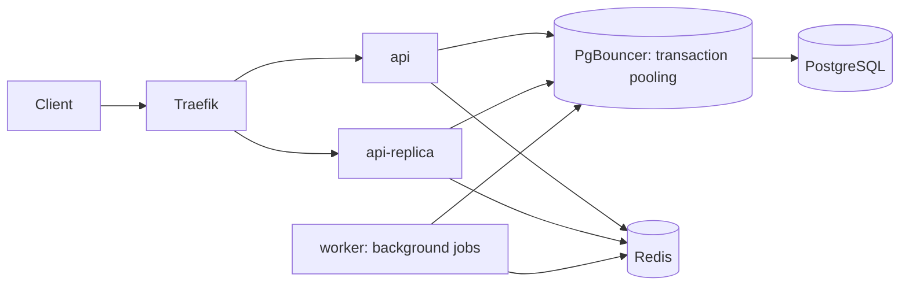

# Scaling and registration-burst safety

UnityRunn is built to safely handle 2,000 concurrent users attempting to
register for the same event the instant registration opens, against a
category with fewer places than that — and to be load-tested to 5,000. This
document explains how, why the existing design was mostly kept as-is, and
what to expect in practice.

## Architecture overview



Two stateless API replicas and one worker process behind Traefik, PgBouncer
in front of PostgreSQL, Redis for locks/rate-limits/caching. See
[`deploy/load-balancing.md`](../deploy/load-balancing.md) for routing,
failover, and the PgBouncer connection-budget math in detail.

## Registration request flow

```
POST /events/{id}/registrations
  → auth.RequireAuth (JWT)
  → Idempotency-Key lookup (replay a stored outcome, or continue)
  → expire any stale PENDING reservations for this caller's path (lazy sweep)
  → per-user rate limit (Redis, RATE_LIMIT_REGISTRATION_MAX/WINDOW)
  → validate event/category are open
  → Redis per-category lock (fast pre-filter, non-blocking)
  → DB transaction: lock category row, count active registrations, insert
  → free category: confirm immediately, issue ticket
  → paid category: create a Bakong checkout, registration stays PENDING
```

## Registration concurrency strategy

`internal/registrations/repository.go`'s `Create()` is the actual source of
the "never oversell" guarantee:

```sql
SELECT capacity FROM event_categories WHERE id = $1 FOR UPDATE;
SELECT count(*) FROM registrations
  WHERE event_category_id = $1 AND status IN ('PENDING', 'CONFIRMED');
-- if count >= capacity: reject
INSERT INTO registrations (...) ...;
```

All in one transaction. The `FOR UPDATE` row lock on the category serializes
every concurrent attempt against that category — the count-then-insert is
effectively atomic per category, and it's been proven under real concurrency
(`TestRepository_ConcurrentRegistration_NeverExceedsCapacity`, and the k6
scenario B burst test below).

**This was deliberately kept over introducing a `reserved_count` counter
column** (a common alternative: `UPDATE event_categories SET reserved_count =
reserved_count + 1 WHERE reserved_count < capacity`). The count-based approach
is self-healing — capacity is always derived by counting real rows, so there
is no counter that can drift out of sync with reality after a bug, a partial
rollback, or a manual data fix. Rewriting working, already-correct
concurrency-critical code to match a *possible* pattern, when the existing one
is provably sound, would have been a pure regression risk for no
correctness gain.

A Redis per-category lock (`internal/registrations/lock.go`) sits in front of
the DB transaction as a throughput pre-filter: a non-blocking `SETNX`, one
holder at a time per category. A caller that doesn't win it gets an immediate
`429 busy` rather than queuing. This is fast and prevents every concurrent
request from piling directly onto the DB, but it means a client that only
tries once will mostly see 429s during a genuine simultaneous burst — see
"Expected bottlenecks" below and the retry logic in
[`k6/scenario_b_registration_burst.js`](../k6/scenario_b_registration_burst.js).

## Reservation and expiry behavior

Registration statuses: `PENDING → CONFIRMED`, or `PENDING → EXPIRED` (payment
window lapsed without a successful payment) / `PENDING → CANCELLED` (genuine
user/admin action) / `CONFIRMED → REFUNDED`.

`EXPIRED` is distinct from `CANCELLED` specifically so support/admin tooling
can tell "timed out" apart from "the user/an admin cancelled it" — both free
the capacity slot identically (`activeStatuses` only counts `PENDING` and
`CONFIRMED`), so this is a reporting distinction, not a capacity-math one.

Two expiry mechanisms exist:

1. **Lazy synchronous sweep** (`Service.expirePendingPayments`) — runs inline
   at the top of `Register()`/`VerifyPayment()`, catching anything whose
   `payments.expires_at` has passed. Deliberately *not* run from read paths
   (`GetAvailability`, `ListForUser`) — a past incident showed a read
   triggering a write transaction that could cancel a just-settled payment.
2. **Leased background reconciler** (`PaymentReconciler`, ticks every 15s) —
   asks the payment provider directly before expiring anything (a payment
   that settles right at the TTL boundary must confirm, not expire — Bakong
   has no refund path). Uses `FOR UPDATE SKIP LOCKED` plus a
   `reconcile_lease_until`/`reconcile_worker_id` lease on the `payments` row,
   so multiple worker replicas can safely partition the same claim queue.

## Payment confirmation flow

There is no inbound Bakong webhook wired up today — `Provider.HandleWebhook`
is stubbed in both implementations and no `/payments/webhook` route exists.
Confirmation is poll-based (`POST /registrations/{id}/payment/verify`, driven
by the client) and reconciler-based (background, doesn't need the browser
open). Building a webhook receiver for an integration that doesn't push one
was treated as speculative scope creep and skipped.

Both confirmation paths funnel through the same atomic step,
`ConfirmStoredPayment`: row-lock the registration, guard the transition with
`WHERE status='PENDING'`, and `INSERT INTO tickets ... ON CONFLICT
(registration_id) DO NOTHING`. Proven directly under real concurrency by
`TestRepository_ConfirmStoredPayment_ConcurrentCallsConfirmExactlyOnce` (20
goroutines confirming the same payment concurrently → exactly one
`CONFIRMED` transition, exactly one ticket).

## Idempotency

`POST /events/{id}/registrations` accepts an `Idempotency-Key` header. A
successful outcome is stored (`idempotency_keys` table, keyed by
`(user_id, key, route)`) and replayed verbatim on retry — the free-category
path stores it inside the same DB transaction as the registration insert; the
paid path stores it as a best-effort write right after the payment step,
since holding a DB transaction open across an external Bakong HTTP call would
be worse. Only successful (201) outcomes are cached; an error carries no
mutated state, so a retry can simply re-run. Error responses are not
byte-for-byte replayed — the partial unique index on
`(user_id, event_id)` remains the real backstop for a retry that misses the
replay window.

## Database locking strategy

- Category row: `SELECT ... FOR UPDATE` inside the registration transaction — the actual capacity guarantee.
- Registration row: `SELECT ... FOR UPDATE` inside `ConfirmStoredPayment` — the payment-confirmation guarantee.
- Payments queue: `FOR UPDATE SKIP LOCKED` + a lease column — safe multi-replica reconciliation.
- Redis category lock: a fast, non-blocking, best-effort throughput pre-filter — not a correctness mechanism, the DB locks above are.

## Redis usage

| Purpose | Key pattern | Notes |
|---|---|---|
| Category lock | `reg:lock:category:{id}` | `SETNX` + Lua compare-and-delete release |
| Availability cache | `reg:availability:category:{id}` | Short TTL, invalidated on every mutation |
| Rate limiting | `reg:ratelimit:{key}`, `auth:login:{hash}`, `ratelimit:ip:{ip}`, `ratelimit:user:{id}` | Shared fixed-window primitive, `internal/ratelimit` |
| Notification queue | `notifications:queue` (list) | Paired with a Postgres sweep for durability — Redis isn't persistent here |

No generic cache-aside abstraction exists; each consumer owns its key
patterns directly against `*redis.Client`.

## DB pooling and PgBouncer

See [`deploy/load-balancing.md`](../deploy/load-balancing.md#process-roles-and-capacity)
for the full connection-budget arithmetic and the PgBouncer/pgx compatibility
notes (`QueryExecModeCacheDescribe`, and why the two other modes tried first
broke real queries in this codebase).

## Rate limiting

Redis fixed-window (`internal/ratelimit`), all configurable via env vars
(defaults match pre-existing hardcoded behavior):

| Route | Default | Key |
|---|---|---|
| `POST /auth/login` | 10/15m | identity hash |
| `POST /events/{id}/registrations` | 5/min | user |
| `GET /events`, `GET /events/{id}` | 100/min | IP |
| `POST /registrations/{id}/payment/verify` | 5/min | user |

The IP-keyed limit depends on Traefik being configured to trust a real
upstream proxy's forwarded-for header (e.g. Cloudflare's IP ranges via
`forwardedHeaders.trustedIPs`) to see real client IPs rather than one shared
address — not yet configured in this repo. Until then, IP-based limiting is
weaker than it looks in a Cloudflare-fronted deployment. This also means: to
load-test scenario A/D from one machine, raise `RATE_LIMIT_EVENTS_READ_MAX`
first — see [`k6/README.md`](../k6/README.md).

## Scaling API replicas and workers

Add another Compose service inheriting `&api-service` and its URL to
`deploy/traefik/api.yml`'s server list — there's no autoscaling, `--scale
api=N` alone doesn't update the explicit pool (see
`deploy/load-balancing.md`). Keep exactly one `worker` — concurrent email
sweeps aren't supported. PgBouncer decouples replica count from PostgreSQL's
own connection limit, so adding replicas no longer means renegotiating
`max_connections`.

## Load testing

See [`k6/README.md`](../k6/README.md) for full instructions. Summary:

```sh
docker compose up -d --build && make migrate
go run ./backend/cmd/loadtestseed -users=2000 -capacity=1000 \
  -users-out=k6/users.json -event-out=k6/event.json
k6 run k6/scenario_b_registration_burst.js -e BASE_URL=http://localhost:8080
go run ./backend/cmd/loadtestseed -verify -category-id=<id> -expect=1000
```

The `-verify` step against the database is the only authoritative check — a
k6-side counter can undercount on a client timeout even when the server
actually committed the write.

## Expected bottlenecks

- **The local Traefik gateway container is undersized for a real 2,000-connection
  burst.** At the default local `GATEWAY_MEMORY_LIMIT=128m`/`GATEWAY_CPU_LIMIT=0.25`,
  a genuine 2,000-VU scenario B run made the gateway container itself restart
  mid-test (`RestartCount` incremented, clean `ExitCode 0`, no OOM flag, no
  error logs — consistent with hitting the memory cgroup limit under load),
  which reset every in-flight connection through it and produced a wave of
  client-side "connection reset by peer" errors. **This was not an
  application bug**: the Go API itself logged zero 500s throughout, and the
  database was still exactly consistent with capacity afterward. Bumping to
  `GATEWAY_MEMORY_LIMIT=512m`/`GATEWAY_CPU_LIMIT=2.0` (well within a modern
  laptop's Docker Desktop budget) eliminated the restarts entirely across
  repeated runs. Load-testing scenario B/D at real scale needs this bump
  first — see [`k6/README.md`](../k6/README.md).

- **Category lock throughput under sustained, non-crashing contention is the
  real, deeper finding.** Once the gateway stopped crashing (so the full,
  uninterrupted 2,000-VU load actually reached the API), successful
  registrations against a 1,000-capacity category dropped sharply — from 687
  in the crash-affected run down to roughly 13–61 across several clean runs —
  even though **zero overselling occurred in any run** (every number stayed
  well under 1,000, confirmed against the database every time, matching the
  server's own access logs exactly whenever the gateway was healthy). This
  was investigated directly, not just observed once:
  - A single, uncontended registration call takes ~10ms — far faster than the
    observed throughput would suggest, ruling out the DB transaction itself
    as the bottleneck.
  - Adding retry jitter (so 2,000 VUs don't retry in perfect lockstep) helped
    marginally (14 → 32) but nowhere near enough to explain the gap.
  - Raising `GOMAXPROCS` for the API containers from 1 to 4 made no
    measurable difference (32 → 20, within noise).
  - Reducing the retry delay 6× (0.3s → 0.05s) also made no measurable
    difference (20 → 13), which rules out "too few retry rounds fit in the
    test window" as the mechanism too.

  None of these interventions meaningfully changed the outcome, and the
  precise mechanism (Redis SETNX fairness under thousands of simultaneous
  contenders vs. container-level network/goroutine scheduling vs. something
  else) was not conclusively isolated — pinning it down further needs real
  profiling on non-laptop hardware, not more guessing locally. What **is**
  conclusively established: correctness held in every single variant tried,
  including the crash-affected run, the jittered run, the fast-retry run, and
  the more-CPU run. The non-blocking, fail-fast lock design (429 + client
  retry, never an unbounded queue) is doing exactly what it was built to do —
  it just means a real, very oversubscribed single event may take longer
  than a client-side demo would suggest to actually fill every seat, even
  though it will never overfill one. If that turns out to matter for a real
  event, treat it as a follow-up (see recommendation 3 below), not something
  this pass fixed.
- **Postgres row-lock contention on one hot category** during the literal
  first second of registration opening — inherent to any design that
  guarantees exact capacity via a single serialization point per category.
- **Single worker process** for email/notification sweeps — by design (no
  concurrent-sweep support), so notification throughput doesn't scale with
  API replica count.
- **Local Docker resource limits** (`GOMAXPROCS=1`, small Postgres
  `shared_buffers`) cap what a laptop-hosted stack can sustain well below
  genuine 5,000-concurrent-user throughput — expected and fine for
  correctness testing, not representative of production capacity.

## Production recommendations

1. Configure Traefik's `forwardedHeaders.trustedIPs` for your real upstream
   (Cloudflare) so IP-keyed rate limiting reflects actual client IPs.
2. Load-test scenario B/D on hardware sized like `docker-compose.dokploy.yml`
   or larger, not a laptop, before treating any throughput number as a
   capacity commitment.
3. If category-lock throughput under contention becomes a real product
   concern (a very oversubscribed single event), revisit the lock's retry
   ergonomics (server-side backoff hints, or accepting a short queued wait
   instead of an immediate 429) as a follow-up — not attempted here, since
   correctness, not throughput tuning, was this pass's priority.
4. Size the production Traefik gateway (`GATEWAY_MEMORY_LIMIT`/
   `GATEWAY_CPU_LIMIT`) for genuine peak concurrent connections, not just
   steady-state traffic — a gateway that restarts under load resets every
   in-flight connection through it, which looks identical to an application
   outage to end users even when the API behind it never errored. `512m`/
   `2.0` resolved this locally at 2,000 VUs; validate the real number on
   production-sized hardware rather than reusing that figure blindly.
4. Complete production Bakong credentials and automated backups (tracked
   separately in `progress.md`) before relying on this for a real paid event.
5. Scrape `/metrics` (Docker-network-only, `METRICS_PORT`) from a real
   Prometheus instance and alert on `registration_sold_out_total`,
   `payment_failure_total`, and worker failure counters during a live event.
